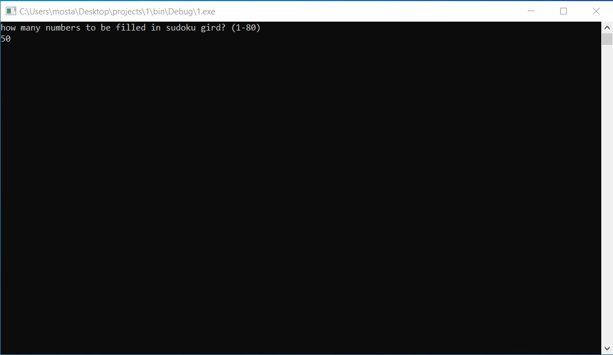
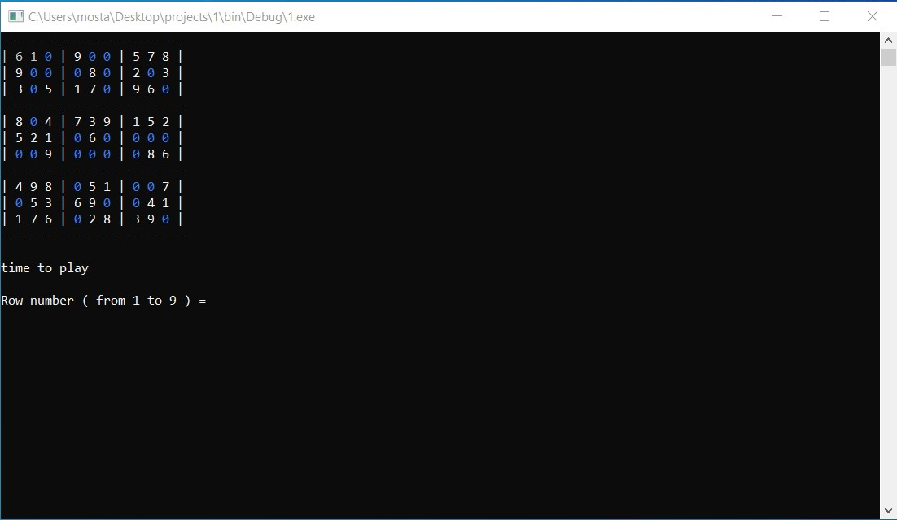
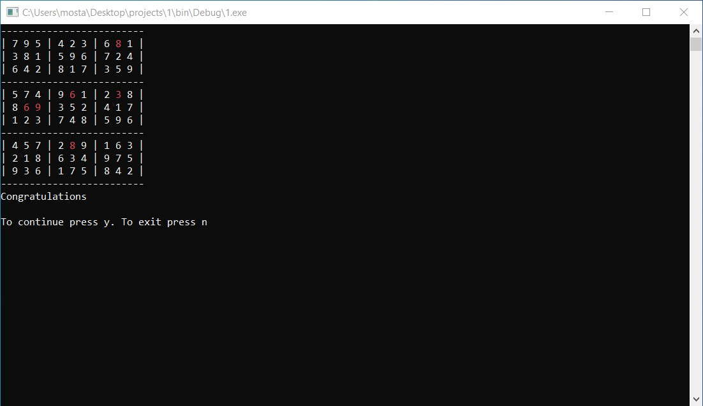

Infinite Sudoku: Sudoku Game with User-Selected Difficulty

This is a Sudoku puzzle game written in C programming language. The game generates a new Sudoku puzzle at the beginning of each try and the player selects the number of cells to fill based on their skill level. The game has infinite levels, making it challenging and entertaining for the player.
The program generates a random Sudoku puzzle using the backtracking algorithm. It first generates a complete Sudoku solution, then removes a certain number of cells randomly to create a puzzle

